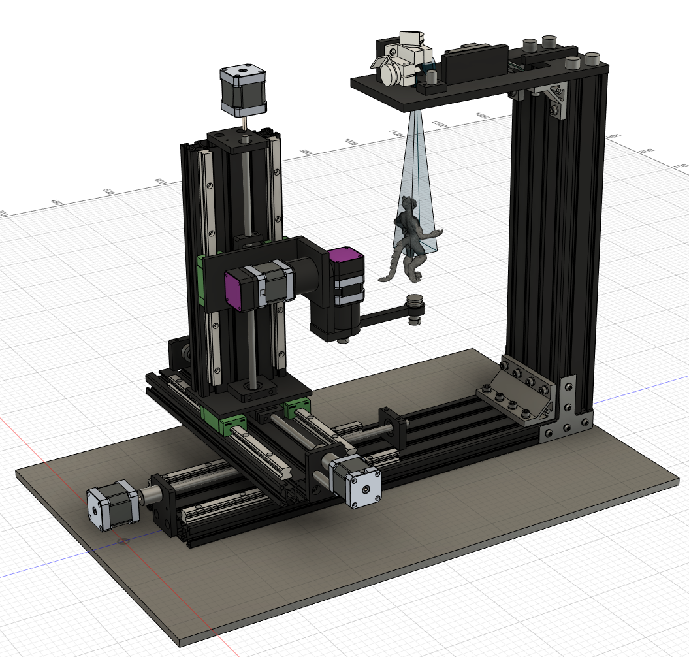
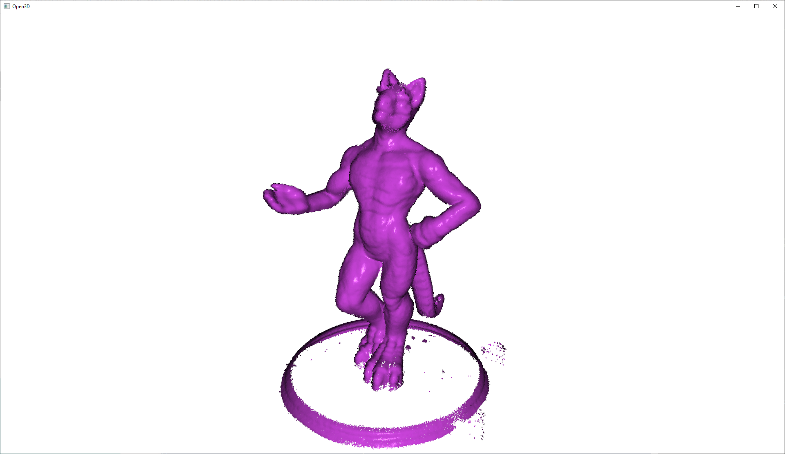
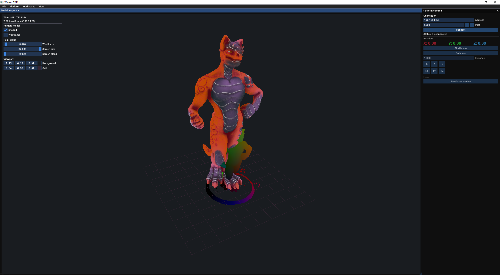
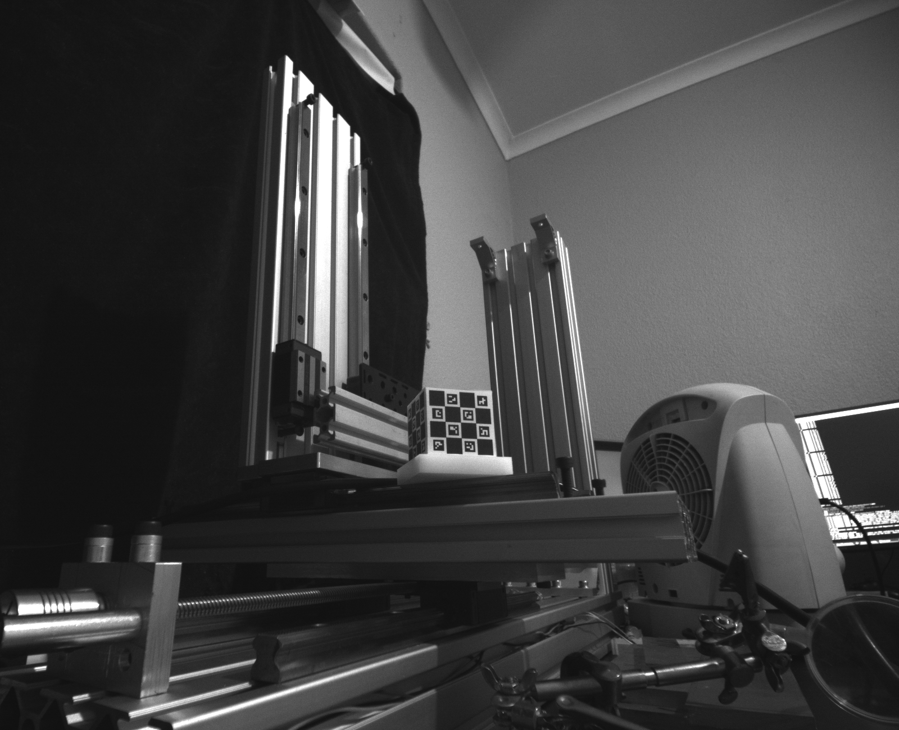

# LDI
Laser direct imager.

# Notes
- Surfel coverage idea: Use basic surfel area technique to determine laser views, then project samples on those surfels. Then use poisson sampling to eliminate samples. Allow overlaps for fuzzy edges.

# Figure paint process

## Print
- UV resin based 3D print.
- Type of resin:
	- Color: White - will be primed.
	- Toughness: Ideally a more flexible, but needs experiments.
- Primed white.
- Connect to kinematic coupling.

## Scan
- Line scan.
- Point filter.
- Mesh fit.

## Toner coat
- Once for Cyan, Magenta, Yellow, and Black.
- Preparation stage between each powder coating.
	- Which preparation medium - degreaser? (Hand soap, etc).
- Dip in fluid bed.
	- Multiple dips, shake, etc.

## Finishing
- Apply semi-gloss coat.

# Color process

## Color accuracy & image reproduction quality
- Initial simulations have shown good coverage, but do not include beam cone.
- Determine performance over varying surface angles/depths and how this relates to color accuracy.

## Galvo
- 4cm x 4cm scan area.
- Scan patterns:
	- Per dot in model surface space.
	- Projected raster based on viewpoint.
- Read galvo feedback to determine settling time over various distances.
	- Very rough estimates:
		- ~190us for 0.5mm
		- ~220us for 1mm
		- ~250us for 2mm
		- ~280us for 4mm

## Galvo driver board
- https://www.instructables.com/Arduino-Laser-Show-With-Real-Galvos/
- https://hackaday.io/project/172284-galvo-laser-cutterengraver
- 2 channel driver. Each channel uses -+ 5V differential lines.
- Component potentials:
	- SPI driven is cool and nice.
	- MCP4822 (12 bit dual channel DAC).
	- DAC8532 (16 bit dual channel DAC).
	- TL082 (2 Opamps) Need 2 opamps per channel.
- Opamps can scale and invert DAC output for diff lines.

## Laser spot & focus
- Measure spot size with pi based camera system.
- Cheap fans cause significant vibration.
- Lower power diodes use a single mode laser which does not create the rectangle spot.
- Shape rectangle spot with 2 prisms.

## Halftoning
- Directed binary search
	- Ordered vs random pixel order.
	- Start image: threshold, full black, full white.
	- Gaussian kernel: 5 - 2, 3 - 2, etc.
	- 10 iterations.
	- Perception kernel: 5 - 2.
- Converting sRGB image to linear before halftoning gives a subjectively closer to original sRGB image look.
- Low end/high end issues:
	- Check papers.
	- Directly related to kernel size?

## Platform calibration
- https://hackaday.io/project/11377-lego-optics-lab-laser-interferometer/details
- Laser line created with masked lens and normal LED diode?
	- Probably not required, laser has proven good.
	- Purchasable masked LED setups are very expensive.
- Machine vision setup
	- Global shutter Arducam cam.
	- Arducam low distortion lens, pick FOV to fit as needed.
	- Laser line is central, directly over sintering laser.
	- Camera is offset horizontally from lasers, pointing at laser focus center.
- Machine vision ideal setup (simulation) is giving micron precision over 17cm target board.

## Galvo field calibration
- Find center line and rotation.
- Hardware scale offset.
- Field linearity.
- Align field to B axis?

# Materials & techniques

## Toner
- Double check IPA to prepare surface.
- Black toner is still very suspicious, clumpy, etc.
	- Double check.
	- Need to try HP black toner to see if better than generic black toner.
- Purchase toner from aliexpress, amazon.
	- https://tonercorp.co.za/product/hp-125a-cyan-cartridge-cb541a/
	- https://home.fourwaysimaging.co.za/welcome/hp-col-toner/
- Use IPA to make toner airbrushable.
	- What ratio?
	- Difficult to reach areas for complex models.
	- Lots of wasted toner in overspray.
- Dip in heavily pigmented IPA?
- Charge plastic for adhesion?
- Plasma treat surface?
- Make surface conductive for powder coating:
	- Does surface really need to be conductive or can small plastic objects still carry enough charge?
	- Fischer Spray Paint Zinc (conductive)
	- https://www.eis.co.za/index.php?route=product/product&product_id=3439 (graphite powder to make conductive spray)
	- https://toolcentre.co.za/brands/graphite-spray-400ml-320g-aer (graphite spray)

## Paint
- Protective layer should be at least twice as resilient as color layer.
- Enamel or resin protective layer?
- Check melting point of protective layer.

- Laser bench tests:
	- Tamiya white primer on polycarb.
	- Polycarb seems to burn easy? Is it the primer or the polycarb that is burning?
	- 150 us pulse
	- ~17.5 cm distance
	- ~25 um burn spot.

- Power to control greyscale: Paint dissolves in “non-binary” way based on power.
- Focus to control greyscale: Same as power

- Paint needs to be transparent.
	- glaze medium.
	- Directly transparent paint.
	- Liquid watercolor paint.

- Photochromic paint?
	- Seems difficult to get irreversible photochromic paint.
	- https://dspace.mit.edu/bitstream/handle/1721.1/121516/2018-chi-colormod-paper.pdf?sequence=2&isAllowed=y

- Use transparent resin as protective layer?
- Masking fluid.

## UV inks
- Maybe various screen printing inks?
- Try some other SA ink retailers.
- Initial tests with UV ink from china could only hold low resolution.

## Photo techniques
- Gum 
	- https://thewetprint.com/en/pigments/
	- Potentially long exposure times.
	- Thick build up of layers?
	- Low resolution?
- Silver halide
	- Too complex (chemicals)?
	- How to tint?
- Black and white high res for luminosity? Then low res color over that?

# Focus tests
2.5W, 94mm, Default lens (taps), 20 * 266

2.5W, 50mm, Default lens (taps), 12.32 * 121.8112

2.5W, 200mm, Default lens (taps), 33.6 * 589.12

2.5W, 200mm, Grey original lens, 33.6 * 748.16

0.5W, 200mm, Grey original lens, 25 * 25 (Perfect), 625um2

0.5W, 100mm, Grey original lens, 13.44 * 13.44, 181um2
(Density is significantly better (~3.4x) than 200mm)

# Dot tests
0.5W, offset: 12mm, burn time: 180us. 35um dots.

0.5W, offset: 10mm, burn time: 220us. 60um dots.

## License
**NOTE: This project includes 3rd party code or resources that have their own license notices. The rest of the assets have been created by myself or are in the public domain.**

**Unlicense (http://unlicense.org) **

This is free and unencumbered software released into the public domain.

Anyone is free to copy, modify, publish, use, compile, sell, or
distribute this software, either in source code form or as a compiled
binary, for any purpose, commercial or non-commercial, and by any
means.

In jurisdictions that recognize copyright laws, the author or authors
of this software dedicate any and all copyright interest in the
software to the public domain. We make this dedication for the benefit
of the public at large and to the detriment of our heirs and
successors. We intend this dedication to be an overt act of
relinquishment in perpetuity of all present and future rights to this
software under copyright law.

THE SOFTWARE IS PROVIDED "AS IS", WITHOUT WARRANTY OF ANY KIND,
EXPRESS OR IMPLIED, INCLUDING BUT NOT LIMITED TO THE WARRANTIES OF
MERCHANTABILITY, FITNESS FOR A PARTICULAR PURPOSE AND NONINFRINGEMENT.
IN NO EVENT SHALL THE AUTHORS BE LIABLE FOR ANY CLAIM, DAMAGES OR
OTHER LIABILITY, WHETHER IN AN ACTION OF CONTRACT, TORT OR OTHERWISE,
ARISING FROM, OUT OF OR IN CONNECTION WITH THE SOFTWARE OR THE USE OR
OTHER DEALINGS IN THE SOFTWARE.

For more information, please refer to <http://unlicense.org>
